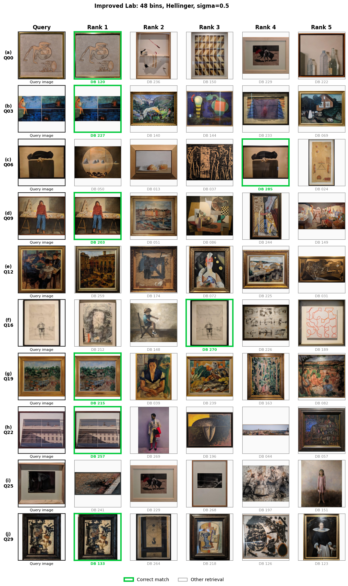

# Team 3 — Week 1 Image Retrieval


Content-based image retrieval for the museum dataset using global color histograms. This repository contains the Week 1 experiments only: color-spaced descriptors, histogram distances, evaluation on QSD1, and blind predictions for QST1.

## Team

- Eduard Barnadas Conangla
- Paula Gálvez Serrano
- Femiloye Oluseun Oyerinde
- Ares Sellart Sánchez

## Approach

For every image, the retrieval pipeline:

1. reads the image in RGB and converts it to the configured color space;
2. computes one global 1D histogram per channel;
3. rebins, optionally smooths, and L1-normalizes each channel independently;
4. applies channel weights and concatenates the channel histograms;
5. ranks database images using the configured histogram distance.

## Experiment progression

The experiments explored grayscale, individual RGB channels, concatenated color spaces, bin counts, smoothing values, distance metrics, and Lab channel weights.

| Stage | Configuration or observation | mAP@1 | mAP@5 | Hit Rate@5 |
|---|---|---:|---:|---:|
| Grayscale baseline | Normalized gray histogram | 0.300 | — | — |
| Earlier RGB bins | Concatenated RGB/BGR, 32–256 bins | 0.367 | — | 0.467 |
| Initial color spaces | Best initial result: HSV with EMD | 0.433 | 0.530 | — |
| Personal RGB baseline | Individual G only, 16 bins, σ=0.5, Hellinger | 0.333 | 0.357 | 0.400 |
| Team HSV selection | 32 bins, σ=1.0, L1, equal weights | 0.500 | 0.596 | 0.767 |
| Team Lab selection | 64 bins, no smoothing, L1, equal weights | 0.533 | 0.599 | 0.733 |
| Team best observed | HSV, 16 bins, σ=0.5, L1, equal weights | 0.567 | 0.629 | 0.767 |
| Improved Lab — simple | 40 bins, no smoothing, L1, equal weights | 0.633 | 0.662 | 0.733 |
| Improved Lab — tuned | 48 bins, σ=0.5, Hellinger, weights 0.125/0.5/0.375 | **0.700** | **0.728** | **0.800** |

The individual RGB experiment is retained as the original non-stacked baseline. HSV improved substantially when all channels were combined. Lab then performed best: it separates lightness (`L`) from the chromatic `a` and `b` axes, allowing the tuned method to reduce sensitivity to illumination by downweighting `L`.

## Retrieval example

Ten QSD1 queries and their top-5 results using the tuned weighted Lab method. Green borders mark correct matches.



## Metrics

| Metric | Meaning |
|---|---|
| mAP@1 | Top-1 accuracy on QSD1, where each query has one correct match. |
| mAP@5 | Gives more credit when the correct match is nearer rank 1. |
| Hit Rate@5 | Percentage of queries with the correct match anywhere in the top 5. |

## Final QST1 methods

| Required folder | Method | Configuration |
|---|---|---|
| `method1` | HSV best | HSV, 16 bins, σ=0.5, L1, equal channel weights |
| `method2` | Weighted Lab | Lab, 48 bins, σ=0.5, Hellinger, weights 0.125/0.5/0.375 |

`qst1_manifest.json` records this mapping and the exact query order, so the generic required folder names do not make the experiment ambiguous.

## Repository structure

```text
data/
  BBDD/                         database images
  qsd1_w1/                     labelled development queries
  qst1_w1/                     blind test queries
assets/                        README figures
src/
  color_histogram_retrieval.py descriptor and retrieval implementation
  data.py                      deterministic dataset loading
  distances.py                 vectorized distance metrics
  evaluation.py                AP, mAP, and Hit Rate@5
  methods.py                   named experiment configurations
scripts/
  evaluate_week1.py            evaluate all named methods on QSD1
  generate_qst1.py             generate and validate QST1 pickles
outputs/week1/                 generated tables, pickles, and manifest
```

## Setup

From the repository root:

```bash
python -m pip install -r requirements.txt
```

The expected default data locations are `data/BBDD`, `data/qsd1_w1`, and
`data/qst1_w1`.

## Evaluate QSD1

Run with the current dataset and output defaults:

```bash
python scripts/evaluate_week1.py
```

Override any path when needed:

```bash
python scripts/evaluate_week1.py \
  --database-dir data/BBDD \
  --query-dir data/qsd1_w1 \
  --ground-truth data/qsd1_w1/gt_corresps.pkl \
  --output outputs/week1/qsd1_results.csv
```

Relative paths are resolved from the repository root. The complete option list is available with `python scripts/evaluate_week1.py --help`.

## Generate QST1 predictions

The default command retrieves the required top 10 results:

```bash
python scripts/generate_qst1.py
```

All runtime paths and `K` can be changed from the command line:

```bash
python scripts/generate_qst1.py \
  --database-dir data/BBDD \
  --query-dir data/qst1_w1 \
  --output-dir outputs/week1/QST1 \
  --manifest outputs/week1/qst1_manifest.json \
  --top-k 10
```
